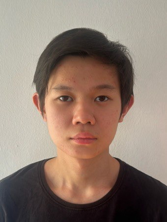
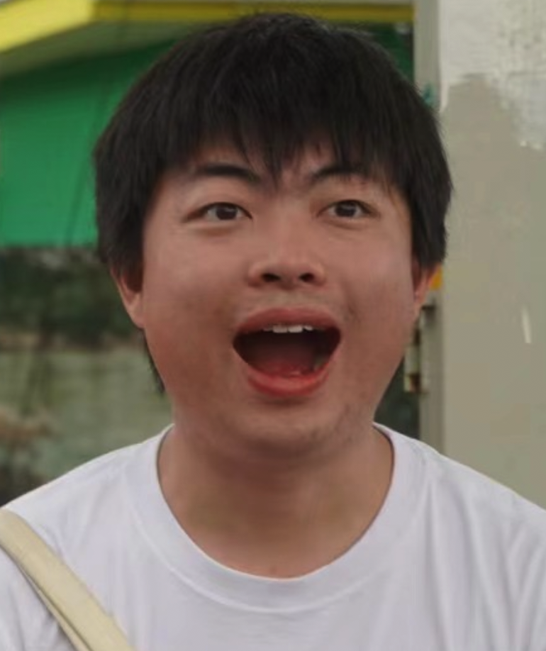
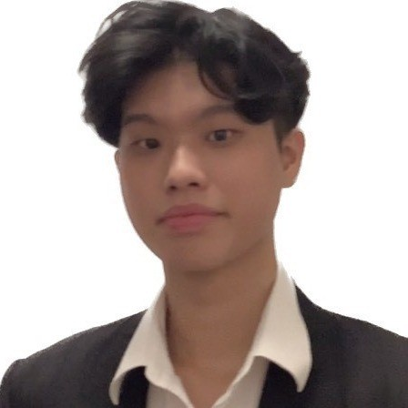

# About Us

We are a team based in the [School of Computing, National University of Singapore](http://www.comp.nus.edu.sg).

You can reach us at the email `e1155567@u.nus.edu`

## Project team

### Tang Kit Meng Shearer

[[github](http://github.com/Shearer1509)]
[[portfolio](team/shearer.md)]

* Role: Developer
* Responsibilities: Dev Ops + Threading

### Gong Yiqian

[[github](http://github.com/wuliyq)]
[[portfolio](https://www.linkedin.com/in/yiqian-gong-7aa12231b)]

* Role: Developer
* Responsibilities: UI

### Tristan Seow

[[github](http://github.com/polyrhythmas)]
[[portfolio](team/johndoe.md)]

* Role: Developer
* Responsibilities: Data

### Lu Haomeng

[[github](http://github.com/FZFZFZZ)]
[[portfolio](team/haomeng.md)]

* Role: Developer
* Responsibilities: UI

### Sim Yee Kai

[[github](http://github.com/simyeekai)]
[[portfolio](team/simyeekai.md)]

* Role: Developer
* Responsibilities: Data
